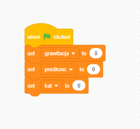
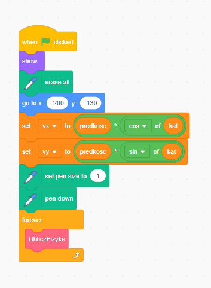
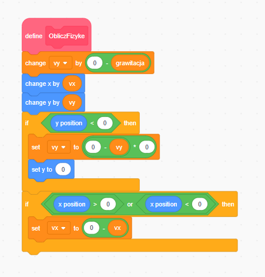
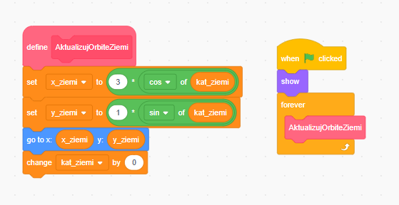
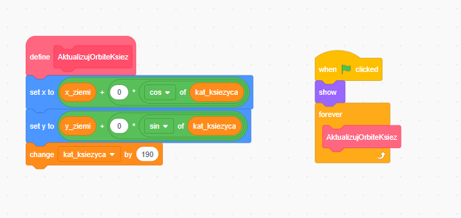

# Laboratorium 01 – Logika Animacji i Symulacja Ruchu

## Opis projektu

Projekt realizuje dwa niezależne zagadnienia z zakresu animacji komputerowej w środowisku Scratch:

- **Zadanie A** (`lab01a.sb3`) – Symulacja rzutu ukośnego oparta na dynamice fizycznej
- **Zadanie B** (`lab01b.sb3`) – Animacja hierarchicznego układu słonecznego oparta na kinematyce

---

## Zadanie A – Rzut Ukośny

### Zasada działania

Obiekt (piłka) jest wystrzeliwany z lewego dolnego rogu sceny. Ruch obliczany jest klatka po klatce zgodnie z metodą Eulera – prędkość i pozycja są aktualizowane na podstawie sił działających na obiekt.

**Grawitacja** jest zaimplementowana jako modyfikacja prędkości pionowej, a nie bezpośrednia zmiana pozycji:

```
vy = vy - grawitacja        ← prawdziwa dynamika
x  = x  + vx
y  = y  + vy
```

Dzięki temu zachowanie obiektu wynika z symulacji fizycznej, nie z ręcznego sterowania współrzędnymi.

**Prędkość początkowa** jest rozkładana na składowe za pomocą trygonometrii:

```
vx = predkosc × cos(kat)
vy = predkosc × sin(kat)
```

### Obsługa kolizji

- **Podłoga** (`y < -150`): odbicie z utratą energii – prędkość pionowa mnożona przez współczynnik `0.7`
- **Ściany boczne** (`x > 230` lub `x < -230`): odbicie elastyczne – odwrócenie prędkości poziomej

### Sterowanie

| Akcja | Efekt |
|---|---|
|  Zielona flaga | Inicjalizacja – piłka staje w pozycji startowej, animacja nie startuje |
| Suwaki | Zmiana parametrów przed startem |
| `SPACJA` | Wystrzelenie piłki z aktualnymi ustawieniami (działa też w trakcie lotu – resetuje rzut) |

### Parametry (suwaki)

| Zmienna | Zakres | Opis |
|---|---|---|
| `grawitacja` | 0.1 – 2.0 | Przyspieszenie grawitacyjne |
| `predkosc` | 1 – 20 | Prędkość początkowa wystrzału |
| `kat` | 0 – 90 | Kąt wystrzału w stopniach |

### Struktura kodu

Logika fizyczna zamknięta jest we własnym bloku `ObliczFizyke`, wywoływanym w pętli `zawsze`. Główny skrypt odpowiada wyłącznie za inicjalizację i uruchomienie symulacji.

```
[ObliczFizyke]
  zmień vy o (0 - grawitacja)
  zmień x o vx
  zmień y o vy
  jeżeli y < -150:
    ustaw vy na (vy × -0.7)
    ustaw y na -150
  jeżeli x > 230 lub x < -230:
    ustaw vx na (0 - vx)
```

### Zrzuty ekranu

#### Skrypt główny – po kliknięciu flagi


#### Skrypt – odbiór komunikatu `start`


#### Własny blok `ObliczFizyke`


---

## Zadanie B – Układ Słoneczny

### Zasada działania

Pozycja każdego ciała niebieskiego obliczana jest ze wzorów trygonometrycznych na podstawie kąta orbity i promienia. Kąt jest inkrementowany co klatkę, co daje płynny ruch obrotowy.

**Ziemia** krąży wokół Słońca:
```
x_ziemi = 120 × cos(kat_ziemi)
y_ziemi = 120 × sin(kat_ziemi)
kat_ziemi = kat_ziemi + 1.5
```

**Księżyc** krąży wokół Ziemi (hierarchia – pozycja Księżyca to pozycja Ziemi + przesunięcie orbitalne):
```
x_ksiezyca = x_ziemi + 45 × cos(kat_ksiezyca)
y_ksiezyca = y_ziemi + 45 × sin(kat_ksiezyca)
kat_ksiezyca = kat_ksiezyca + 4
```

Dzięki temu Księżyc automatycznie podąża za Ziemią bez ręcznego liczenia złożonej spirali.

### Duszki

| Duszek | Rola | Promień orbity | Prędkość kątowa |
|---|---|---|---|
| Słońce | Punkt centralny, nieruchomy | – | – |
| Ziemia | Krąży wokół Słońca | 120 px | 1.5°/klatkę |
| Księżyc | Krąży wokół Ziemi | 45 px | 4°/klatkę |

### Struktura kodu

Każde ciało posiada własny blok obliczeniowy:

- `AktualizujOrbiteZiemi` – oblicza pozycję Ziemi i aktualizuje zmienne `x_ziemi`, `y_ziemi`
- `AktualizujOrbiteKsiez` – oblicza pozycję Księżyca na podstawie aktualnych `x_ziemi`, `y_ziemi`

Oba bloki wywoływane są niezależnie w pętli `zawsze` na swoich duszkach.

### Zrzuty ekranu

#### Własny blok `AktualizujOrbiteZiemi`


#### Własny blok `AktualizujOrbiteKsiez`


---

## Wymagania

- Scratch 3.0 (przeglądarka: [scratch.mit.edu](https://scratch.mit.edu) lub aplikacja desktopowa)
- Rozszerzenie **Pióro** – wymagane przez `lab01a.sb3`, ładowane automatycznie

## Uruchomienie

1. Wejdź na [scratch.mit.edu/projects/editor](https://scratch.mit.edu/projects/editor)
2. `Plik` → `Wczytaj z komputera`
3. Wybierz `lab01a.sb3` lub `lab01b.sb3`
4. Kliknij zieloną flagę ▶

## Kryteria oceny

| Ocena | Zrealizowane wymagania |
|---|---|
| 3.0 | Działa rzut ukośny LUB układ słoneczny |
| 4.0 | Działają oba systemy, kod podzielony na własne bloki, czytelne nazwy zmiennych |
| **5.0** | **Oba systemy, parametryzacja suwakami, obsługa krawędzi, dokumentacja ze zrzutami ekranu** |
