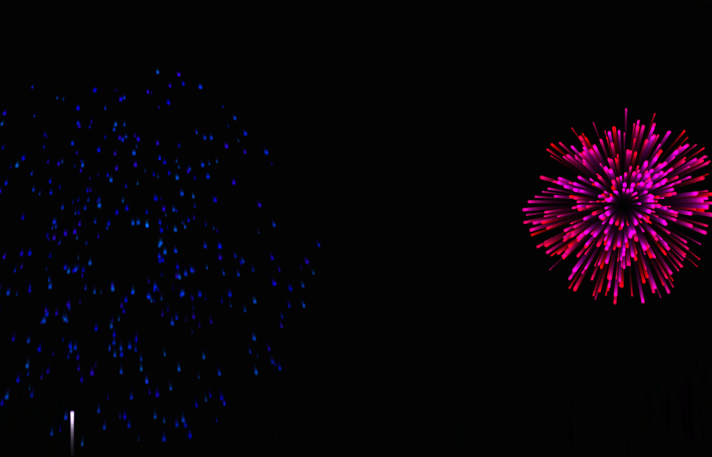
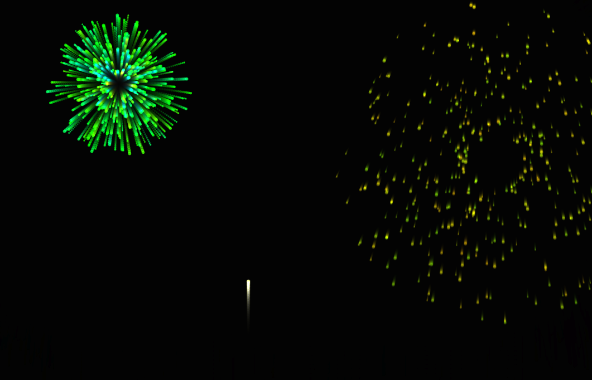

# Pokaz Fajerwerków -- Lab 03

Interaktywna symulacja fajerwerków zbudowana w HTML5 Canvas i czystym JavaScript.





## Funkcjonalności

- Symulacja fizyki cząsteczek w czasie rzeczywistym (grawitacja, opór powietrza, kolizja z podłożem)
- Kliknięcie w dowolne miejsce na canvasie odpala fajerwerk w danej pozycji
- Tryb automatycznego pokazu z losowymi odstępami czasowymi
- Konfigurowalne parametry przez panel sterowania:
  - Siła grawitacji
  - Liczba cząsteczek na eksplozję
  - Prędkość rakiety
  - Szybkość zanikania cząsteczek
- Efekty wizualne:
  - Efekt Trails (półprzezroczyste czyszczenie klatek)
  - Addytywne blendowanie (tryb composite `lighter`)
- Licznik FPS z aktualną liczbą cząsteczek i rakiet
- Architektura obiektowa (klasy Particle, Firework, FireworkShow)

## Struktura projektu

```
lab3/
  index.html      -- główny plik HTML ze stylami i interfejsem
  script.js       -- logika aplikacji (Particle, Firework, FireworkShow)
  screenshots/    -- zrzuty ekranu do dokumentacji
  README.md
```

## Uruchomienie

Projekt wymaga dowolnego statycznego serwera HTTP:

```bash
# Python
python -m http.server 3000

# Node.js
npx serve -l 3000
```

Następnie otwórz `http://localhost:3000` w przeglądarce.

## Panel sterowania

| Parametr                | Zakres         | Domyślnie |
|-------------------------|----------------|-----------|
| Grawitacja              | 0.01 -- 0.20   | 0.06      |
| Liczba cząsteczek       | 20 -- 400      | 120       |
| Prędkość rakiety        | 3 -- 16        | 8         |
| Szybkość zanikania      | 0.005 -- 0.040 | 0.015     |
| Automatyczny pokaz      | wł./wył.       | wł.       |
| Efekt Trails            | wł./wył.       | wł.       |
| Addytywne blendowanie   | wł./wył.       | wł.       |

## Szczegóły techniczne

- **Renderowanie**: HTML5 Canvas 2D z `requestAnimationFrame`
- **System cząsteczek**: Każda eksplozja generuje N cząsteczek z losowym kierunkiem i prędkością, model kolorów HSLA z wariacją odcienia per fajerwerk
- **Fizyka**: Integracja Eulera per klatka z grawitacją, tłumieniem prędkości (0.98) i odbiciem od podłoża z utratą energii (restytucja 0.6)
- **Kompozycja**: Opcjonalne addytywne blendowanie (`globalCompositeOperation: 'lighter'`) dla efektu poświaty
- **Efekt Trails**: Półprzezroczysta czarna nakładka (`rgba(0,0,0,0.15)`) zamiast pełnego czyszczenia -- daje efekt rozmycia ruchu

